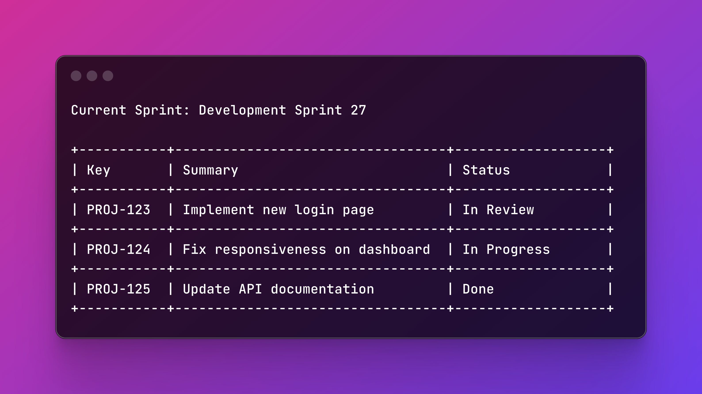

<div align="center">

# jit

Jira CLI for ticket lookup, detailed issue inspection, sprint views, and creating or editing issues from the terminal.

[](https://crates.io/crates/jit-cli)
[](LICENSE)

[Install](#install) · [Quickstart](#quickstart) · [Agent Setup](#agent-setup) · [Examples](#examples) · [Commands](#commands)



</div>

---

## Quick Examples

```bash
# summary
jit ISSUE-123
```

```text
Ticket:   ISSUE-123
Summary:  Fix the login button in Safari
```

```bash
# one-line output
jit --text ISSUE-123
```

```text
ISSUE-123: Fix the login button in Safari
```

```bash
# json
jit --json ISSUE-123
```

```json
{"ticket":"ISSUE-123","summary":"Fix the login button in Safari"}
```

```bash
# full table
jit --show --full ISSUE-123
```

```text
TICKET DETAILS

ISSUE-123: Fix the login button in Safari

Type:       Bug                  Priority:   Medium
Status:     In Progress          Sprint:     Development Sprint 27
Assignee:   John Doe             Reporter:   Jane Smith
Created:    2023-09-15           Updated:    2023-09-16
Due Date:   2023-09-30
```

```bash
# current sprint
jit --my-tickets --limit 3
```

```text
Current Sprint: Development Sprint 27

+-----------+----------------------------------+-------------------+
| Key       | Summary                          | Status            |
+-----------+----------------------------------+-------------------+
| PROJ-123  | Implement new login page         | In Review         |
+-----------+----------------------------------+-------------------+
| PROJ-124  | Fix responsiveness on dashboard  | In Progress       |
+-----------+----------------------------------+-------------------+
| PROJ-125  | Update API documentation         | Done              |
+-----------+----------------------------------+-------------------+
```

## Install

```bash
cargo install jit-cli
```

Build from source:

```bash
git clone https://github.com/cesarferreira/jit
cd jit
cargo build --release
./target/release/jit --version
```

## Quickstart

Create `~/.config/jit/.env`:

```bash
mkdir -p ~/.config/jit
cat > ~/.config/jit/.env <<'EOF'
JIRA_BASE_URL=https://your-company.atlassian.net
JIRA_API_TOKEN=your_api_token_here
JIRA_USER_EMAIL=your_email@example.com
EOF
```

Then run a few common commands:

```bash
# Ticket summary
jit ISSUE-123

# Compact one-line output
jit --text ISSUE-123

# Full ticket details with comments and PRs
jit --show --full ISSUE-123

# Current sprint tickets assigned to you
jit --my-tickets

# Create a backlog ticket
jit create --project RW --summary "Improve ticket creation flow"

# Edit an existing issue
jit edit RW-123 --summary "Refine edit flow"
```

## Agent Setup

<details>
<summary>Install the shared <code>SKILL.md</code> into Codex or Claude Code</summary>

The repo ships a shared agent skill in [`SKILL.md`](SKILL.md).

### Codex

```bash
mkdir -p ~/.codex/skills/jit
wget -O ~/.codex/skills/jit/SKILL.md \
  https://raw.githubusercontent.com/cesarferreira/jit/refs/heads/main/SKILL.md
```

```bash
mkdir -p ~/.codex/skills/jit
curl -fsSL \
  https://raw.githubusercontent.com/cesarferreira/jit/refs/heads/main/SKILL.md \
  -o ~/.codex/skills/jit/SKILL.md
```

### Claude Code

```bash
mkdir -p ~/.claude/skills/jit
wget -O ~/.claude/skills/jit/SKILL.md \
  https://raw.githubusercontent.com/cesarferreira/jit/refs/heads/main/SKILL.md
```

```bash
mkdir -p ~/.claude/skills/jit
curl -fsSL \
  https://raw.githubusercontent.com/cesarferreira/jit/refs/heads/main/SKILL.md \
  -o ~/.claude/skills/jit/SKILL.md
```

</details>

## Examples

### Ticket lookup

Default summary output:

```bash
jit ISSUE-123
jit https://your-company.atlassian.net/browse/ISSUE-123
```

Example output:

```text
Ticket:   ISSUE-123
Summary:  Fix the login button in Safari
```

Compact output for scripts or quick scanning:

```bash
jit --text ISSUE-123
```

Example output:

```text
ISSUE-123: Fix the login button in Safari
```

JSON output:

```bash
jit --json ISSUE-123
jit --json https://your-company.atlassian.net/browse/ISSUE-123
```

Example output:

```json
{"ticket":"ISSUE-123","summary":"Fix the login button in Safari"}
```

### Detailed issue views

Show a formatted table:

```bash
jit --show ISSUE-123
jit --show https://your-company.atlassian.net/browse/ISSUE-123
```

Include richer context as needed:

```bash
jit --show --include-description ISSUE-123
jit --show --include-comments ISSUE-123
jit --show --include-prs ISSUE-123
jit --show --full ISSUE-123
jit --json --full ISSUE-123
```

`--full` is the shortest path when you want description, comments, pull requests, and metadata together.

Example output:

```text
TICKET DETAILS

ISSUE-123: Fix the login button in Safari

Type:       Bug                  Priority:   Medium
Status:     In Progress          Sprint:     Development Sprint 27
Assignee:   John Doe             Reporter:   Jane Smith
Created:    2023-09-15           Updated:    2023-09-16
Due Date:   2023-09-30

DESCRIPTION

The login button doesn't work properly in Safari browsers.
Steps to reproduce:
1. Open the login page in Safari
2. Click on the login button
3. Nothing happens
```

### Comments, history, and linked PRs

Limit comments:

```bash
jit --show --include-comments --comments-limit 3 ISSUE-123
jit --json --include-comments --comments-limit 3 ISSUE-123
```

Return all comments:

```bash
jit --show --include-comments --all-comments ISSUE-123
jit --json --include-comments --all-comments ISSUE-123
```

Filter comments by date:

```bash
jit --show --include-comments --since 2026-01-01 ISSUE-123
jit --json --include-comments --since 2026-01-01 ISSUE-123
```

Include linked pull requests:

```bash
jit --show --include-prs ISSUE-123
jit --json --include-prs ISSUE-123
```

### Current sprint tickets

No arguments defaults to your current sprint tickets:

```bash
jit
```

Explicit forms:

```bash
jit --my-tickets
jit --my-tickets --include-prs
jit --my-tickets --limit 5
```

Example output:

```text
Current Sprint: Development Sprint 27

+-----------+----------------------------------+-------------------+
| Key       | Summary                          | Status            |
+-----------+----------------------------------+-------------------+
| PROJ-123  | Implement new login page         | In Review         |
+-----------+----------------------------------+-------------------+
| PROJ-124  | Fix responsiveness on dashboard  | In Progress       |
+-----------+----------------------------------+-------------------+
| PROJ-125  | Update API documentation         | Done              |
+-----------+----------------------------------+-------------------+
```

### Create backlog tickets

Create a basic backlog task:

```bash
jit create --project RW --summary "Improve ticket creation flow"
```

Create with explicit type and description:

```bash
jit create \
  --project RW \
  --type Story \
  --summary "Support backlog ticket creation" \
  --description $'Add a create command\nCover it with tests'
```

Create with a specific assignee:

```bash
jit create \
  --project RW \
  --type Bug \
  --assignee 5b10a2844c20165700ede21g \
  --summary "Fix backlog create validation"
```

Leave the ticket unassigned:

```bash
jit create \
  --project RW \
  --assignee unassigned \
  --summary "Triage backlog item without owner yet"
```

Return the created issue as JSON:

```bash
jit create --project RW --summary "Improve ticket creation flow" --json
```

By default, `jit create` assigns the issue to the current Jira user with `--assignee me` and leaves it out of a sprint, which is what puts it in the backlog on Scrum boards.

Example output:

```text
Created:  RW-123
Project:  RW
Type:     Task
Assignee: Cesar Ferreira
Summary:  Improve ticket creation flow
Backlog:  Yes (created without sprint assignment)
URL:      https://your-company.atlassian.net/browse/RW-123
```

### Create tickets in the current sprint

Create directly in the active sprint:

```bash
jit create \
  --project RW \
  --current-sprint \
  --summary "Deliver current sprint ticket creation"
```

Target a specific board:

```bash
jit create \
  --project RW \
  --current-sprint \
  --board 123 \
  --summary "Use the board's active sprint"
```

When `--current-sprint` is set, `jit` resolves the active sprint through Jira Software and adds the new issue after creation. If you do not pass `--board`, `jit` checks accessible Scrum boards for the project and uses the active sprint with the most recent `startDate`.

### Edit existing tickets

Update the summary:

```bash
jit edit RW-123 --summary "Improve edit flow"
```

Update the description:

```bash
jit edit RW-123 --description $'First line\nSecond line'
```

Clear the description:

```bash
jit edit RW-123 --description ''
```

Change issue type and assignee:

```bash
jit edit RW-123 --type Bug --assignee 5b10a2844c20165700ede21g
```

Keep a task as `Task` while updating other fields:

```bash
jit edit RW-123 --type Task --summary "Refine task summary"
```

Unassign the issue:

```bash
jit edit RW-123 --assignee unassigned
```

Use the current Jira user as assignee:

```bash
jit edit RW-123 --assignee me
```

Return update results as JSON:

```bash
jit edit RW-123 --summary "Improve edit flow" --json
```

Example output:

```text
Updated:  RW-123
Fields:   summary
Summary:  Improve edit flow
URL:      https://your-company.atlassian.net/browse/RW-123
```

`jit edit` updates only the fields you pass. It works for Task issues as well as other Jira issue types. `--description ''` clears the description, and `--assignee unassigned` clears the assignee.

### Use a specific env file

```bash
jit --env-file /path/to/.env ISSUE-123
jit --env-file /path/to/.env --my-tickets
jit --env-file /path/to/.env create --project RW --summary "Improve ticket creation flow"
jit --env-file /path/to/.env edit RW-123 --summary "Improve edit flow"
```

## Commands

| Command | What it does |
|---|---|
| `jit ISSUE-123` | Show ticket summary |
| `jit --text ISSUE-123` | Show one-line `KEY: Summary` output |
| `jit --json ISSUE-123` | Return machine-readable JSON |
| `jit --show ISSUE-123` | Show detailed ticket fields in a table |
| `jit --show --full ISSUE-123` | Include description, comments, pull requests, and metadata |
| `jit --my-tickets` | List current sprint tickets assigned to you |
| `jit create ...` | Create a Jira issue, backlog by default |
| `jit create --current-sprint ...` | Create an issue and add it to the active sprint |
| `jit edit ...` | Update summary, description, type, or assignee |
| `jit --env-file /path/to/.env ...` | Use a specific credentials file |

## Configuration

`jit` looks for Jira credentials in this order:

1. `--env-file <path>`
2. `.env` in the current directory
3. `~/.config/jit/.env`
4. Environment variables already set in your shell

Example config:

```bash
JIRA_BASE_URL=https://your-company.atlassian.net
JIRA_API_TOKEN=your_api_token_here
JIRA_USER_EMAIL=your_email@example.com
```

## Development

Run locally:

```bash
cargo run -- ISSUE-123
cargo run -- --my-tickets
cargo run -- create --project RW --summary "Improve ticket creation flow"
```

Build a release binary:

```bash
cargo build --release
```

Get an Atlassian API token:

1. Go to `https://id.atlassian.com/manage-profile/security/api-tokens`
2. Click `Create API token`
3. Name it
4. Copy it into `~/.config/jit/.env`

## License

MIT © Cesar Ferreira
